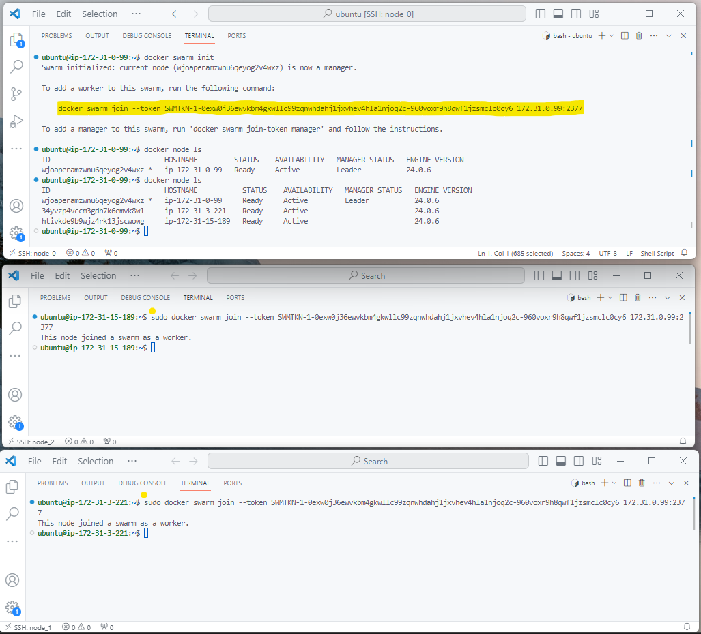

 **Orquestração** é o ato de conseguir gerenciar e escalar os containers da 
nossa aplicação.
- Temos um serviço que rege sobre outros serviços, verificando se os 
mesmos estão funcionando como deveriam.
- Desta forma conseguimos garantir uma aplicação saudável e também que 
esteja sempre disponível.
- Alguns serviços: Docker Swarm, Kubernetes e Apache Mesos.


## Docker Swarm

Uma ferramenta do Docker para orquestrar containers.
- Permite escalar horizontalmente nossos projetos;
- Tem a facilidade que os comandos são muito semelhantes ao do Docker.
- Toda instalação do Docker já vem com Swarm, porém desabilitado.


### Conceitos fundamentais
- Nodes: é uma instância (máquina).
- Manager Node: Node que gerencia os demais Nodes.
- Worker Node: Nodes que trabalham em função do Manager.
- Service: Um conjunto de Tasks que o Manager Node manda o Work Node executar.
- Task: comandos que são executados nos Nodes.

#### Iniciando o Swarm

Podemos iniciar o Swarm com o comando: ```docker swarm init```
- Em alguns casos precisamos declarar o IP do servidor com a flag: ```--advertise-addr```.
- Isso fará com que a instância se transforme em um Node **Manager**.

Para desfazer o swarm init podemos usar o o comando: ```docker swarm leave -f```

#### Listagem de Nodes
Podemos verificar quais Nodes estão ativos com: ```docker node ls```
- Desta forma os serviços serão exibidos permitindo assim monitorar o que o Swarm está orquestrando.


#### Adicionando Workers Nodes

 Podemos adicionar um novo serviço com o comando: docker swarm join --token <TOKEN> <IP>:<PORTA>
 O comando join é exposto quando se define o Manager com o ```docker swarm init```.
- Desta forma teremos as instancias conectadas.
- Esta nova máquina entra na hierarquia como Worker;
- Todas as ações (Tasks) utilizadas na Manager, serão replicadas nos Worker.

Para desfazer o swarm join podemos também usar o o comando: ```docker swarm leave```



--------------------------------------

#### Subindo um serviço
Podemos iniciar um serviço com o comando: ```docker service create --name <nome> <imagem>```
- Desta forma teremos um container (serviço) sendo adicionado ao nosso Manager.
- E este serviço estará sendo gerenciado pelo Swarm.
- Podemos adicionar outras flags ao comando como para liberar a porta 80 do container.
- Exemplo:
 ```docker service create --name nginxswarm -p 80:80 nginx```


#### Listando e Removendo serviços
- Podemos listar os serviços que estão rodando com: ```docker service ls```
- Podemos remover um serviço com: ```docker service rm <identificador_do_service>```


### Aumentando o número de réplicas
- Podemos criar um serviço com um número maior de réplicas: ```docker service create --name <NOME> --replicas <NUMERO> <IMAGEM>```
- Desta maneira uma task será emitida, replicando este serviço nos Workers
- Agora iniciamos de fato a orquestração
- Exemplo: ``` docker service create --name nginxswarm --replicas 3 -p 80:80 nginx ```


#### Verificando a orquestração
- Basta remover um container de um node : ```docker service rm <id> -f ```
- Isso fará com que o Swarm reinicie este container novamente, pois o serviço ainda está rodando no Manager, e isto é uma de suas atribuições: garantir que os serviços estejam sempre disponíveis;


#### Checando token do Swarm
- As vezes vamos precisar checar o token do Swarm, para dar join em alguma outra instância
- Então temos o comando: ```docker swarm join-token manager```
- Desta forma recebemos o token pelo terminal;

#### Checando o Swarm
- Podemos verificar detalhes do Swarm que o Docker está utilizando;
- Utilizamos o comando: ```docker info```
- Desta forma recebemos informações como: ID do Node, número de nodes, número de managers e etc


#### Removendo instância do Swarm
- Podemos parar de executar o Swarm em uma determinada instância
- Vamos utilizar o comando: ```docker swarm leave -f```
- A partir deste momento, a instância não é contada mais como um Node para o Swarm e todos os containners são stopados
- Porém isso não remove o node do swarm, apenas muda o status para DOWN quando checamos o ```docker node ls```


#### Removendo um Node
- Podemos também remover um Node do nosso ecossistema do Swarm;
- Vamos utilizar o comando: ```docker node rm <ID> -f ```
- Desta forma a instância não será considerada mais um Node, saindo do Swarm
- O container continuará rodando na instância, porém o join com o manager não vai funcionar, o que vai exigir refazer a estrutura do swarm


#### Inspecionando serviços
- Podemos ver em mais detalhes o que um serviço possui
- O comando é: ```docker service inspect <ID>```
- Vamos receber informações como: nome, data de criação, portas e ect


#### Verificar containers ativados pelo service
- Podemos ver quais containers um serviço já rodou:
- O comando é: ```docker service ps <ID>```
- Receberemos uma lista de containers que estão rodando e seu historico
- Este comando é semelhante ao ```docker ps -a```


#### Rodando Compose com Swarm
- Para rodar Compose com Swarm vamos utilizar os comandos de Stack;
- O comando é: ```docker stack deploy -c <ARQUIVO.YAML> <NOME>```
- Teremos então o arquivo compose sendo executado;
- Porém agora estamos em modo swarm e podemos utilizar os Nodes como
réplicas;


#### Aumentando réplicas do Stack
- Podemos criar novas réplicas nos Worker Nodes;
- Vamos utilizar o comando: ```docker service scale <NOME>=<REPLICAS>```
- Desta forma as outras máquinas receberão as Tasks a serem executadas;


#### Fazer serviço não receber mais Tasks
- Podemos fazer com que um serviço não receba mais ‘ordens’ do
Manager;
- Para isso vamos utilizar o comando: ```docker node update --availability
drain <ID>```
- O status de drain, é o que não recebe tasks;
- Podemos voltar para active, e ele volta ao normal;


#### Atualizar parâmetro
- Podemos atualizar as configurações dos nossos nodes;
- Vamos utilizar o comando: ```docker service update --image <IMAGEM>
<SERVICO>```
- Desta forma apenas os nodes que estão com o status active receberão
atualizações;


#### Criando rede para Swarm
- A conexão entre instâncias usa um driver diferente, o overlay;
- Podemos criar primeiramente a rede com docker network create;
- E depois ao criar um service adicionar a flag --network <REDE> para
inserir as instâncias na nossa nova rede;


#### Conectar serviço a uma rede
- Podemos também conectar serviços que já estão em execução a uma
rede;
- Vamos utilizar o comando de update: ```docker service update --network
<REDE> <NOME>```
- Depois checamos o resultado com inspect;


